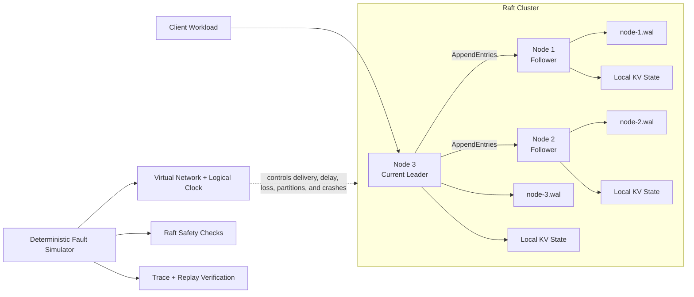
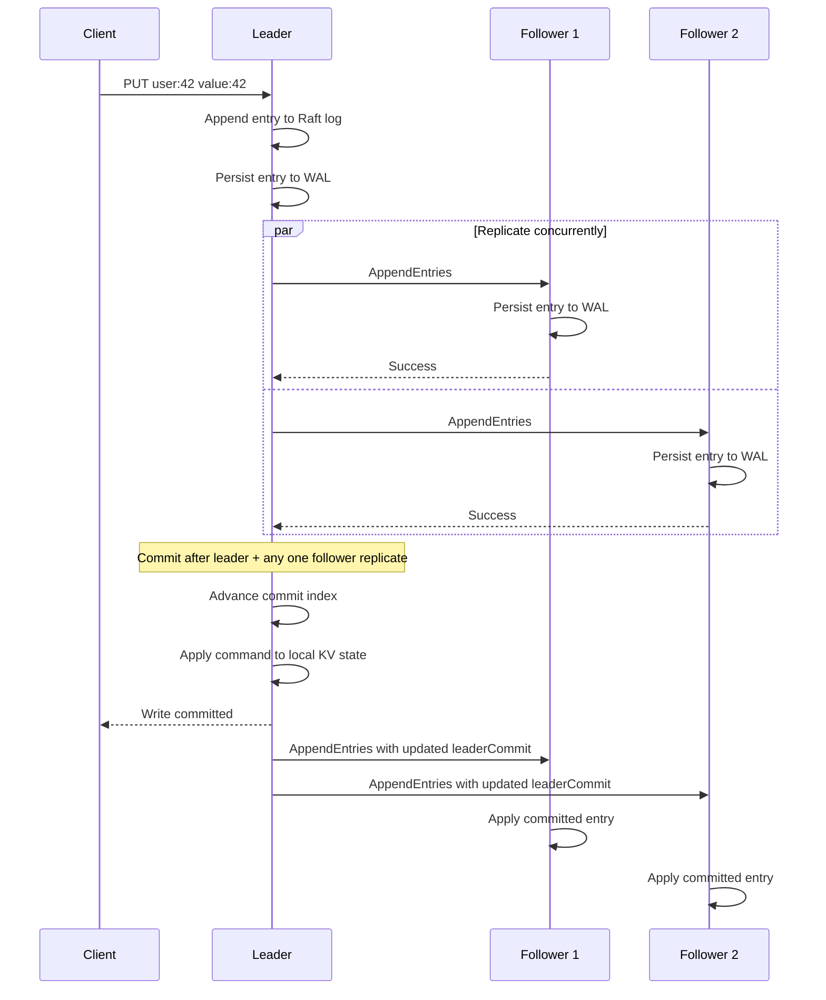
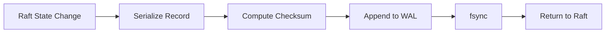

# Distributed Key-Value Store with Raft Consensus

A C++20 distributed key-value store that replicates data across multiple nodes using a custom Raft implementation. The system includes deterministic fault simulation, crash recovery through a disk-backed write-ahead log, trace replay, and runtime correctness checks for consensus safety.

The project focuses on the hard parts of distributed systems: keeping replicas consistent, preserving committed data through failures, recovering stale nodes, and reproducing rare failure sequences reliably.

## Architecture



Each node maintains its own Raft state, replicated log, key-value state machine, and optional disk WAL. One node acts as leader, while the remaining nodes replicate its log and participate in majority decisions.

## How writes are committed



A write is committed only after a majority of nodes has replicated it. Once committed, the command is applied to each node’s local key-value state machine in log order.

## Raft behavior

The implementation supports leader election, heartbeats, replicated logs, majority-based commit, follower log repair, and automatic leader failover.

Nodes transition between follower, candidate, and leader states. If followers stop receiving heartbeats, they begin a new election. A candidate becomes leader after receiving votes from a majority.

When a follower falls behind or contains conflicting uncommitted entries, the leader moves backward through the follower’s log until it finds a matching prefix, then repairs the divergent suffix.

## Deterministic fault simulation

The simulator runs on logical time rather than real sleeping or uncontrolled thread scheduling. Every timeout, message delivery, crash, restart, and client operation is processed as an ordered event.

A seed controls:

- election timeout selection
- network delay
- message loss
- message duplication
- generated client operations
- crash and partition timing

The same command with the same seed produces the same event sequence and trace hash. This makes rare failures reproducible instead of timing-dependent.

Supported scenarios include normal replication, leader failover, network partitions, and randomized campaigns containing writes, deletes, crashes, restarts, partitions, delayed messages, dropped messages, and duplicate messages.

## Disk-backed write-ahead log

Each node can persist its Raft state to a separate append-only WAL file:

```text
wal-data/node-1.wal
wal-data/node-2.wal
wal-data/node-3.wal
```

The WAL stores the node’s current term, vote, and Raft log. Records include metadata, payload length, and a checksum.

Before a persistence operation returns, the record is appended and flushed with `fsync`. This prevents a node from acknowledging replicated state that exists only in memory.

On restart, the node replays its WAL and reconstructs its durable Raft state. If the final record is incomplete because of a crash during a write, the file is truncated back to the last valid record. Corruption in the middle of the WAL is reported instead of silently ignored.



## Correctness validation

The simulator checks core Raft safety properties while events are being processed.

It verifies that:

- no term has multiple live leaders
- a node never applies entries beyond its commit index
- commit and apply indexes never exceed the local log
- matching log entries imply matching prefixes
- two nodes never commit different commands at the same log index
- future leaders retain previously committed entries

Client operations are also recorded with stable request IDs, invocation times, completion times, and retry counts. Completed `PUT` and `DELETE` operations are checked for write-history consistency against real-time ordering and the final database state.

A successful run reports results such as:

```text
Write linearizability: PASS completed=66 pending=3
Node 1 role=follower term=12 commit=71 applied=71 alive=true
Node 2 role=follower term=12 commit=71 applied=71 alive=true
Node 3 role=leader   term=12 commit=71 applied=71 alive=true
```

Matching commit indexes, applied indexes, and final key-value state across nodes show that the cluster converged after the injected failures.

## Build

Requirements:

- CMake 3.16 or newer
- a C++20 compiler
- macOS or Linux

```bash
cmake -S . -B build
cmake --build build -j
ctest --test-dir build --output-on-failure
```

## Run a leader failover scenario

```bash
./build/raft-simulator \
  --seed 42 \
  --events 4000 \
  --users 25 \
  --scenario failover
```

This run elects a leader, writes part of the workload, crashes the current leader, elects a replacement, writes the remaining records, restarts the former leader, and synchronizes all replicas.

## Run with disk persistence

```bash
rm -rf wal-data

./build/raft-simulator \
  --seed 42 \
  --events 4000 \
  --users 25 \
  --scenario failover \
  --wal-dir wal-data
```

Verify the generated WAL files:

```bash
ls -lh wal-data
wc -c wal-data/*.wal
```

## Run a randomized fault campaign

```bash
./build/raft-simulator \
  --seed 2026 \
  --events 16000 \
  --scenario random \
  --operations 80 \
  --keys 8 \
  --drop-rate 0.03 \
  --duplicate-rate 0.02 \
  --wal-dir wal-random
```

This combines client operations with deterministic crashes, restarts, partitions, healing, message loss, and message duplication.

## Save and replay a run

```bash
./build/raft-simulator \
  --seed 42 \
  --events 4000 \
  --users 25 \
  --scenario failover \
  --trace-out failover.trace
```

Replay the recorded configuration:

```bash
./build/raft-simulator --replay failover.trace
```

A successful replay prints:

```text
Replay verification: PASS
```

Replay reconstructs the run from the saved configuration and confirms that the regenerated execution produces the expected trace hash.

## Example result

```text
Trace hash: 93515da01324e7b2
Write linearizability: PASS completed=25 pending=0

Node 1 role=follower term=3 commit=27 applied=27 alive=true
Node 2 role=follower term=3 commit=27 applied=27 alive=true
Node 3 role=leader   term=3 commit=27 applied=27 alive=true
```

All nodes end with the same committed log position and the same key-value state, even after leader failure and recovery.
