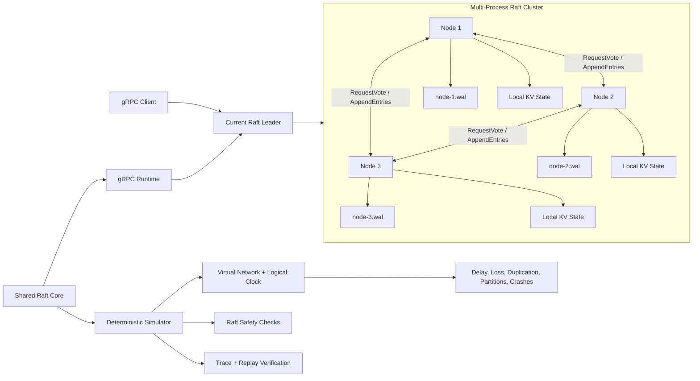
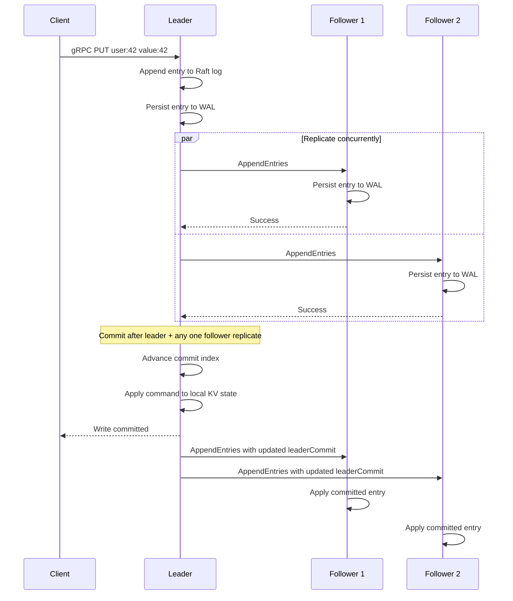
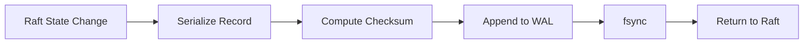

# Distributed Key-Value Store with Raft Consensus

A C++20 distributed key-value store with a custom Raft implementation, deterministic fault simulation, disk-backed crash recovery, and a real multi-process gRPC runtime.

The project focuses on the difficult parts of distributed systems: keeping replicas consistent, preserving committed data through failures, recovering stale nodes, reproducing rare failure sequences, and validating the same Raft core under both simulated and real network execution.

## Architecture



The project has two execution modes:

- a deterministic simulator using logical time and a virtual network
- a gRPC runtime where each Raft node runs as an independent process over TCP

Both modes reuse the same Raft logic, state machine, and persistence layer.

## How writes are committed



A write is committed only after a majority of nodes has replicated it. Committed commands are applied to each node’s local key-value state machine in log order.

## Raft behavior

The implementation supports leader election, heartbeats, replicated logs, majority-based commit, follower log repair, and automatic leader failover.

Nodes transition between follower, candidate, and leader states. Followers start a new election after missing heartbeats. A candidate becomes leader after receiving votes from a majority.

When a follower contains conflicting uncommitted entries or falls behind, the leader searches backward for a matching log prefix and replaces the divergent suffix.

## gRPC runtime

The gRPC runtime runs every Raft node as a separate process with its own:

- network endpoint
- Raft state
- local key-value state machine
- WAL file
- election and heartbeat timers

Protobuf defines the wire contracts for Raft RPCs and client operations. Nodes exchange `RequestVote` and `AppendEntries` messages over gRPC, while clients use RPCs for `PUT`, `GET`, `DELETE`, and status queries.

The runtime uses a serialized event loop so concurrent gRPC handlers do not mutate Raft state directly from multiple threads.

## Deterministic fault simulation

The simulator runs on logical time rather than real sleeping or uncontrolled thread scheduling. Every timeout, message delivery, crash, restart, and client operation is processed as an ordered event.

A seed controls:

- election timeout selection
- network delay
- message loss
- message duplication
- generated client operations
- crash and partition timing

The same command with the same seed produces the same event sequence and trace hash. This makes rare failures reproducible instead of timing-dependent.

Supported scenarios include normal replication, leader failover, network partitions, and randomized campaigns containing writes, deletes, crashes, restarts, partitions, delayed messages, dropped messages, and duplicate messages.

## Disk-backed write-ahead log

Each node can persist its Raft state to a separate append-only WAL file:

```text
wal-data/node-1.wal
wal-data/node-2.wal
wal-data/node-3.wal
```

The WAL stores the node’s current term, vote, and Raft log. Records include metadata, payload length, and a checksum.

Before persistence returns, each record is appended and flushed with `fsync`. This prevents a node from acknowledging replicated state that exists only in memory.

On restart, the node replays its WAL and reconstructs its durable Raft state. An incomplete final record is truncated back to the last valid record, while corruption in the middle of the WAL is reported explicitly.



## Correctness validation

The simulator checks core Raft safety properties while events are processed.

It verifies that:

- at most one node is observed as leader for a given term
- a node never applies entries beyond its commit index
- commit and apply indexes never exceed the local log
- matching log entries imply matching prefixes
- two nodes never commit different commands at the same log index
- future leaders retain previously committed entries

Client operations are recorded with stable request IDs, invocation times, completion times, and retry counts. Completed `PUT` and `DELETE` operations are checked for write-history consistency against real-time ordering and the final database state.

The write checker validates completed write histories; it is not a general-purpose read/write linearizability proof.

## Build

Requirements:

- CMake 3.16 or newer
- a C++20 compiler
- Protobuf
- gRPC
- macOS or Linux

On macOS:

```bash
brew install cmake protobuf grpc
```

Build and run tests:

```bash
cmake -S . -B build
cmake --build build -j
ctest --test-dir build --output-on-failure
```

The build produces:

```text
build/raft-simulator
build/kv-server
build/kv-client
```

## Run a three-node gRPC cluster

Create a WAL directory:

```bash
mkdir -p wal-data
```

Start each node in a separate terminal.

Node 1:

```bash
./build/kv-server \
  --id 1 \
  --listen 127.0.0.1:7001 \
  --wal wal-data/node-1.wal \
  --peer 1=127.0.0.1:7001 \
  --peer 2=127.0.0.1:7002 \
  --peer 3=127.0.0.1:7003
```

Node 2:

```bash
./build/kv-server \
  --id 2 \
  --listen 127.0.0.1:7002 \
  --wal wal-data/node-2.wal \
  --peer 1=127.0.0.1:7001 \
  --peer 2=127.0.0.1:7002 \
  --peer 3=127.0.0.1:7003
```

Node 3:

```bash
./build/kv-server \
  --id 3 \
  --listen 127.0.0.1:7003 \
  --wal wal-data/node-3.wal \
  --peer 1=127.0.0.1:7001 \
  --peer 2=127.0.0.1:7002 \
  --peer 3=127.0.0.1:7003
```

Check cluster status:

```bash
./build/kv-client 127.0.0.1:7001 status
./build/kv-client 127.0.0.1:7002 status
./build/kv-client 127.0.0.1:7003 status
```

Example:

```text
node=1 role=follower term=53 commit=31 applied=31 leader_id=2
node=2 role=leader   term=53 commit=31 applied=31 leader_id=2
node=3 role=follower term=53 commit=31 applied=31 leader_id=2
```

## Run client operations

Send commands to the current leader:

```bash
./build/kv-client 127.0.0.1:7002 put user:42 value:42
./build/kv-client 127.0.0.1:7002 get user:42
./build/kv-client 127.0.0.1:7002 delete user:42
```

Example output:

```text
committed=true is_leader=true leader_id=2 error=
found=true value=value:42 leader_id=2 error=
```

A follower rejects writes and returns the current leader when known.

## Test leader failover

Stop the current leader with `Ctrl+C`, wait for a new election, and query the remaining nodes:

```bash
./build/kv-client 127.0.0.1:7001 status
./build/kv-client 127.0.0.1:7003 status
```

Send another write to the newly elected leader. Restart the failed node using the same node ID, address, and WAL path. It recovers its durable state and catches up with the current leader.

## Run a deterministic leader-failover scenario

```bash
./build/raft-simulator \
  --seed 42 \
  --events 4000 \
  --users 25 \
  --scenario failover
```

This run elects a leader, writes part of the workload, crashes the leader, elects a replacement, writes the remaining records, restarts the former leader, and synchronizes all replicas.

## Run the simulator with disk persistence

```bash
rm -rf wal-sim

./build/raft-simulator \
  --seed 42 \
  --events 4000 \
  --users 25 \
  --scenario failover \
  --wal-dir wal-sim
```

Verify the generated files:

```bash
ls -lh wal-sim
wc -c wal-sim/*.wal
```

## Run a randomized fault campaign

```bash
./build/raft-simulator \
  --seed 2026 \
  --events 16000 \
  --scenario random \
  --operations 80 \
  --keys 8 \
  --drop-rate 0.03 \
  --duplicate-rate 0.02 \
  --wal-dir wal-random
```

This combines client operations with deterministic crashes, restarts, partitions, healing, message loss, and message duplication.

## Save and replay a run

```bash
./build/raft-simulator \
  --seed 42 \
  --events 4000 \
  --users 25 \
  --scenario failover \
  --trace-out failover.trace
```

Replay the saved configuration:

```bash
./build/raft-simulator --replay failover.trace
```

A successful replay prints:

```text
Replay verification: PASS
```

Replay regenerates the deterministic execution from the saved configuration and verifies that the resulting trace hash matches the recorded hash.

## Example simulator result

```text
Trace hash: 93515da01324e7b2
Write linearizability: PASS completed=25 pending=0

Node 1 role=follower term=3 commit=27 applied=27 alive=true
Node 2 role=follower term=3 commit=27 applied=27 alive=true
Node 3 role=leader   term=3 commit=27 applied=27 alive=true
```

All nodes end with the same committed log position and key-value state after leader failure and recovery.
